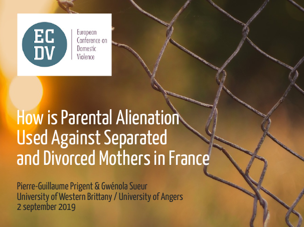

# Français (*english below*)

Le 2 septembre 2019 à l'ECDV (European Conference On Domestic Violence [#ECDV2019](https://twitter.com/hashtag/ECDV2019)) à Oslo, en Norvège, [Gwénola Sueur](https://gwenolasueur.wordpress.com/) et moi-même avons présenté la première étude qualitative réalisée auprès de mères séparées et divorcées accusées d'aliénation parentale en France.

Les slides (en anglais) ayant servi de support à l'intervention sont [téléchargeables au format PDF](/post/Prigent_Sueur_2019_online.pdf). Elles ont été modifiées pour leur mise en ligne. Merci de ne pas les diffuser en dehors de ce site. Si vous souhaitez y faire référence, vous pouvez utiliser l'adresse de la [page actuelle](https://pgtpg.github.io/29/09/2019/how-is-parental-alienation-used-against-separated-and-divorced-mothers-in-france/).

Voici l'abstract de cette communication.

**Comment l'aliénation parentale est utilisée contre les mères séparées et divorcées en France**

*Notre objectif est de présenter les résultats d'une étude menée auprès de 16 mères en France qui ont été accusées d'aliénation parentale, pendant ou après la séparation. En France, le concept d'aliénation parentale est apparu à la fin des années 90. D'abord défendu par des psychologues, puis propagé par des groupes de défense des droits des pères, ce concept a été fréquemment mentionné dans les débats politiques ou médiatiques sur la séparation et la résidence des enfants. Après que l'aliénation parentale ait été critiquée pour son manque de fondements scientifiques et les risques liés à son utilisation dans les tribunaux de la famille, le ministère français de la Justice a décidé d'informer les magistrats concernant les problèmes posés par l'utilisation de ce concept. Malgré cette nouvelle directive, des éléments montrent qu'il est toujours mentionné dans des procédures civiles.*

*Après avoir analysé les stratégies employées par les groupes de défense des droits des pères pour diffuser le concept d'aliénation parentale et la jurisprudence dans ce domaine, nous avons interrogé 16 femmes qui ont été accusées d'aliénation parentale par leur ex-conjoint, des proches, des avocats, des travailleurs sociaux ou des juges. Les participantes ont été recrutées à l'aide des réseaux sociaux et une analyse du contenu des entretiens a été effectuée.*

*Nous avons découvert que l'aliénation parentale était toujours mentionnée dans un contexte de violence conjugale, et sous plusieurs formes : même lorsque le concept n'était pas explicitement utilisé, ses idées sous-jacentes étaient toujours présentes. De plus, les accusations d'aliénation parentale n'impliquaient pas automatiquement un transfert de résidence, mais elles pouvaient néanmoins influencer les décisions de justice en faveur des pères violents.*

*L'aliénation parentale est utilisée comme stratégie pour occulter la violence masculine, principalement par les hommes violents eux-mêmes, des proches ou des institutions. Elle réduit la violence conjugale à des conflits parentaux et pathologise les femmes et les enfants. Ceci est lié à un problème plus large d'identification de la violence conjugale en France (identification basée principalement sur la psychanalyse), et à une tendance à saper la crédibilité des mères violentées et de leurs enfants.*

# English

On September 2, 2019 at the ECDV (European Conference On Domestic Violence [#ECDV2019](https://twitter.com/hashtag/ECDV2019)) in Oslo, Norway, [Gwénola Sueur](https://gwenolasueur.wordpress.com/) and I presented the first qualitative study conducted with separated and divorced mothers accused of parental alienation in France.

The slides used for the intervention are [downloadable in PDF format](Prigent_Sueur_2019_online.pdf). They have been modified for posting online. Please do not share them outside this site. If you wish to refer to it, you can use the address of the [current page](https://pgtpg.github.io/29/09/2019/how-is-parental-alienation-used-against-separated-and-divorced-mothers-in-france/).

Here is the abstract of the communication.

**How is Parental Alienation Used Against Separated and Divorced Mothers in France**

*Our aim is to present the results of a study conducted with 16 mothers in France who have been accused of parental alienation, during or after separation. In France, the concept of parental alienation appeared in the late nineties. First defended by psychologists and later propagated by fathers’ rights groups, it has been frequently mentioned in political or media debates regarding separation and child custody. After being criticized for its lack of scientific evidence and the risks associated with its use in family courts, the French Ministry of Justice decided to inform its magistrates about issues related to the use of this concept. Despite this new guideline, evidence shows that it is still mentioned in civil proceedings.*

*Following an analysis of both the strategies employed by fathers’ rights groups to disseminate the concept of parental alienation and the jurisprudence in this area, we conducted interviews with 16 women who had been accused of parental alienation by fathers, relatives, lawyers, social workers or judges. The participants were recruited using social medias, and a content analysis of the interviews was performed.*

*We discovered that parental alienation was always mentioned in a context of domestic violence, and in several forms: even when the concept was not explicitly used, its underlying ideas were still present. Moreover, accusations of parental alienation did not automatically imply a change in custody arrangements, but it could nonetheless influence the decisions in favor of the violent fathers.*

*Parental alienation is used as a strategy to conceal male violence, by violent men themselves, relatives or institutions, mainly. It reduces domestic violence to parental conflict and pathologizes women and children. This is linked to a wider problem of identification of domestic violence in France (mainly psychoanalysis based), and a tendency to undermine the credibility of abused mothers and their children.*

---

Et il est toujours possible de visionner la vidéo (en français) de notre intervention du 26 avril 2018 à l'Université du Québec à Montréal sur l'histoire et l'usage du syndrome d'aliénation parentale contre les mères séparées en France :

*And it is still possible to watch the video (in French) of our intervention of April 26, 2018 at the Université du Québec à Montréal on the history and use of parental alienation syndrome against separated mothers in France:*

<iframe width="560" height="315" src="https://www.youtube.com/embed/Rw0sRBrfqLo" frameborder="0" allow="accelerometer; autoplay; encrypted-media; gyroscope; picture-in-picture" allowfullscreen></iframe>

Voir aussi (*see also*) :

Prigent, P.-G. et Sueur, G. (2020). À qui profite la pseudo-théorie de l'aliénation parentale ? *Revue Délibérée*, *9*(1), 57‑62. [Cairn](https://www.cairn.info/revue-deliberee-2020-1-page-57.htm) / [blog de la revue *Délibérée*](https://blogs.mediapart.fr/revue-deliberee/blog/010720/qui-profite-la-pseudo-theorie-de-l-alienation-parentale).